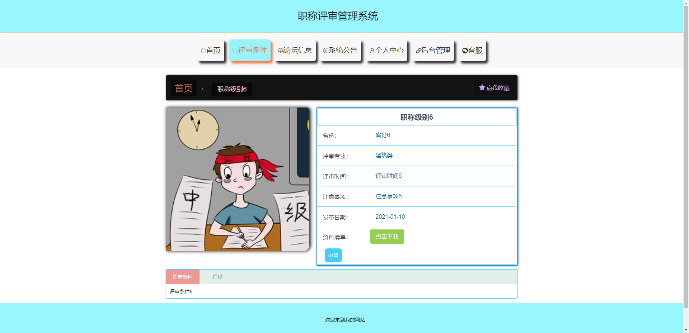
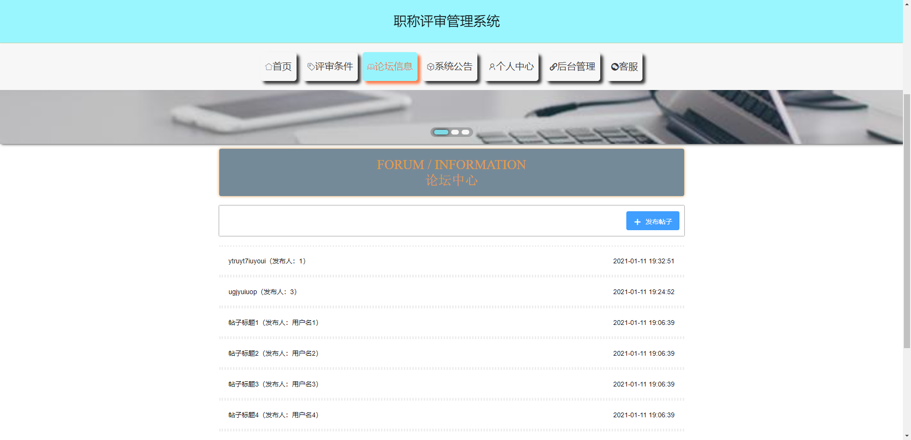
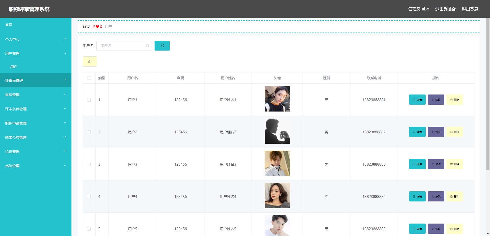
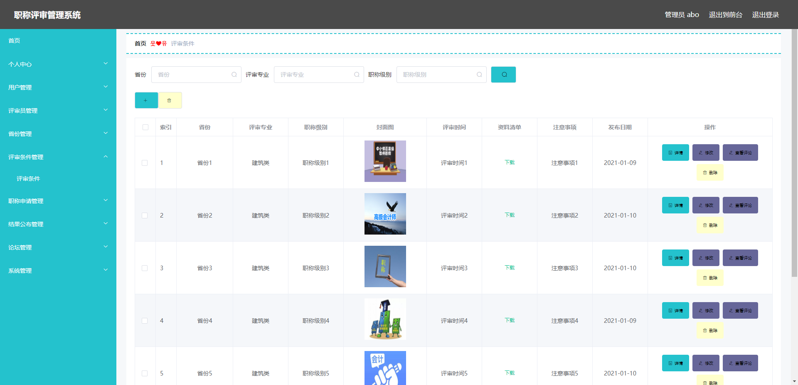
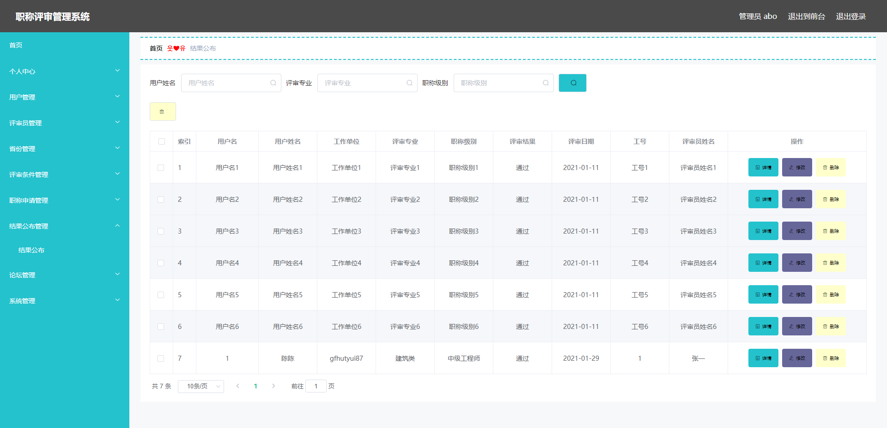
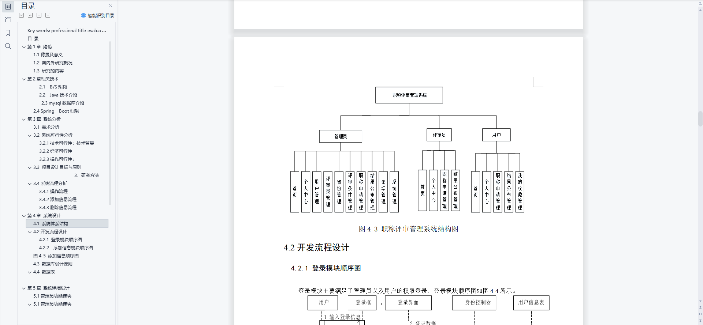
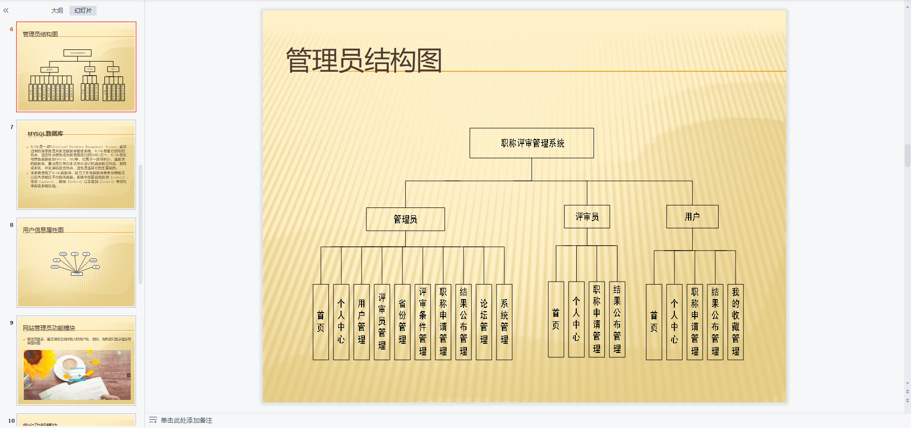
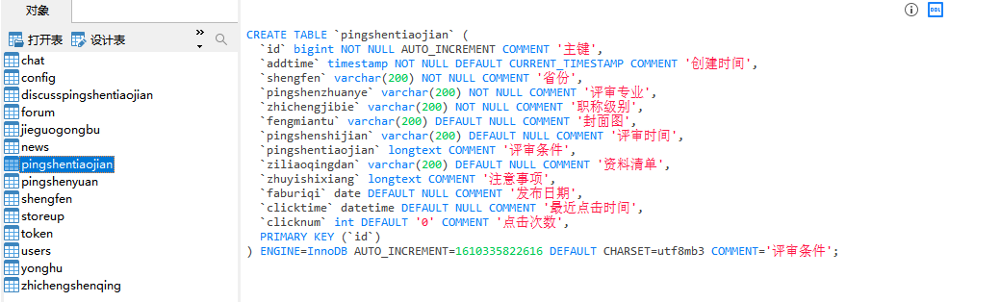

# 1 项目介绍
基于SSM+Vue的职称评审管理系统：后端 SpringBoot、Mybatis-Plus，前端Vue+ElementUI，具体功能如下：
## 管理员
- 个人中心：查看和修改个人信息、修改密码
- 用户管理
- 评审员管理
- 省份管理
- 评审条件管理
- 职称申请管理
- 结果公布管理
- 系统管理(客服管理、轮播图管理、系统公告)
## 用户
- 个人中心：查看和修改个人信息、修改密码
- 职称申请管理
- 结果公布管理
- 我的收藏管理
## 评审员
- 个人中心：查看和修改个人信息、修改密码
- 职称申请管理
- 结果公布管理
# 2 系统运行截图
## 2.1 用户登录

## 2.2 评审条件

## 2.3 评审条件详情

## 2.4 论坛信息

## 2.5 用户管理

## 2.6 评审条件管理

## 2.7 评审结果管理

## 2.8 万字文档

## 2.9 ppt

# 3 数据库设计

# 4 完整源码数据库获取(收费)

